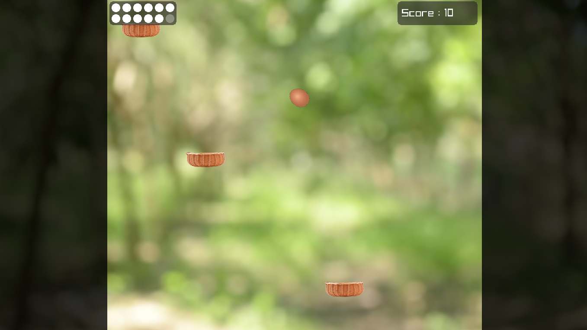
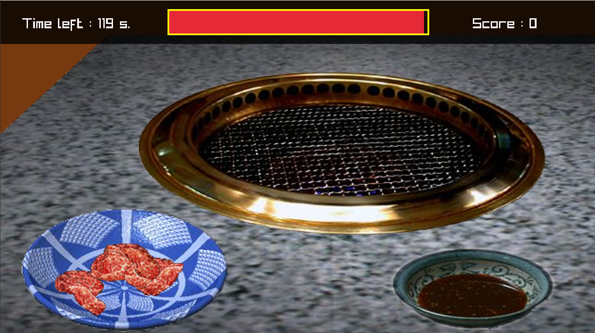

# COMPUTER PROGRAMMING MINI PROJECT
## ไข่ตัวร้ายกับนายเนื้อย่าง

  

### รายละเอียด
> โครงงานการพัฒนาเกมด้วยภาษาซี ชื่อเกม ไข่ตัวร้ายกับนายเนื้อย่างนี้ เป็นส่วนหนึ่งของ วิชา COMPUTER PROGRAMMING (06016315)
จัดทำขึ้นโดยมีวัตถุประสงค์เพื่อนำเอาความรู้จากการเขียนโปรแกรมด้วยภาษาซีซึ่งเป็นภาษาได้รับความสนใจและเป็นที่นิยมในปัจจุบันมาประยุกต์เข้ากับการออกแบบสื่อประสมมัลติมีเดีย 
โดยได้ศึกษารูปแบบและพัฒนาเกมมาจากเกมในอตีดที่ถูกสร้างด้วยโปรแกรม Adobe Flash โดยในปัจจุบันเว็บเบราว์เซอร์บางประเภทไม่รองรับการแสดงผล Flash Player 
ทำให้เกมเก่าในอตีดไม่สามารถเล่นได้อีกต่อไป ทางผู้จัดทำจึงได้แนวคิดในการนำเกมเก่ามาสร้างด้วยภาษาซีแทน ทั้งนี้ได้ทำการเสนอแนวเกมออกมาในรูปแบบ 2 มิติ โดยนำความรู้ในการเขียนโปรแกรมด้วยภาษาซี
มาช่วยในการออกแบบเพื่อสร้างตัวเกม ให้ได้รูปแบบเกมที่ให้ผู้เล่นได้รับทั้งความบันเทิงและได้รับความรู้ฝึกสมาธิไปพร้อมกัน และสร้างเสริมพัฒนาทักษะด้านการเขียนโปรแกรม (Coding Skills) 
คณะผู้จัดทำหวังเป็นอย่างยิ่งว่า โครงงานการพัฒนาเกมด้วยภาษาซี ชื่อเกม ไข่ตัวร้ายกับนายเนื้อย่าง จะสร้างความสนุกสนานในการเล่นและมีประโยชน์ด้านการเป็นแนวทางในการออกแบบเกมด้วยภาษาซีแก่ผู้พบเห็น

### เกี่ยวกับเกม
> เกม "ไข่ตัวร้ายกับนายเนื้อย่าง" เป็นเกมที่สร้างขึ้นมาเลียนแบบเกม Beef Grill (焼き肉亭) และเกม The Amazing Dare-Dozen โดยทั้งสองเกมต้นฉบับสร้างขึ้นมาด้วย Flash และต้องเล่นผ่านเว็บไซต์ผ่านโปรแกรม Flash Player ซึ่งกำลังจะหมดการสนับสนุนในบราวเซอร์ใหม่ ๆ ในเร็ววันนี้ ทางผู้จัดทำจึงตัดสินใจทำเกมเลียนแบบขึ้นมาโดยเขียนด้วยภาษา C ที่สามารถเล่นได้บนระบบปฏิบัติการ Windows ได้อยู่ตลอด และยังสามารถแปลง Source code ของเรา ไปบนแพลตฟอร์มอื่นได้ด้วยเช่น Mac OS และ Android เนื่องจากทางผู้จัดทำได้พัฒนาเกมโดยใช้ Libary "Raylib"

  
  

### วิธีการเล่น
> ภายในเกม "ไข่ตัวร้ายกับนายเนื้อย่าง" จะมีเกมย่อย 2 เกมได้แก่ "ไข่ตัวร้าย" และ "นายเนื้อย่าง" โดยสามารถเลือกที่จะเล่นได้ทันทีที่เปิดเกม
###### ไข่ตัวร้าย
> ผู้เล่นจะได้บังคับไข่ฟองหนึ่งที่ต้องกระโดดไปตามตะกร้าที่อยู่สูงขึ้นไปเรื่อยๆ ด้วยเหตุผลบางอย่าง ผู้เล่นจะต้องขึ้นไปให้ถึง ชั้นที่ 145 โดยจะมีชีวิตทั้งหมด 12 ชีวิต โดยเมื่อผู้เล่นกระโดดพลาดตกจากตะกร้าจะถูกหัก 1 ชีวิตและเมื่อชีวิตหมดจะถือว่าเกมจบและสรุปคะแนนที่ได้รับ และระหว่างทางจะมีข้อความ ภายในเกมให้อ่านเพื่อทราบรายละเอียดบางอย่างเกี่ยวกับเกมนี้? เนื้อเรื่องอย่างนั้นเหรอ?
###### นายเนื้อย่าง
> เมื่อเริ่มเกมผู้เล่นจะมีเวลา 120 วินาทีและแต้มชีวิต 100% ในการเล่น ผู้เล่นจะต้องนำเนื้อภายในจานไปย่าง และเมื่อเนื้อสุกจะต้องนำเนื้อใส่ถ้วยน้ำจิ้มเพื่อรับประทาน โดยในแต่ละวินาที เวลาจะนับถอยลังลง และในทุกๆ 2 วินาที แต้มเลือดของผู้เล่นจะลดลง 2 หน่วย และเมื่อเวลา หรือแต้มเลือดหมดจะถือว่าเกมจบทันทีแล้วสรุปคะแนนที่ได้รับ โดยผู้เล่นจะได้รับแต้มเลือดเพิ่มเมื่อทานเนื้อที่ย่างอย่างพอดี แต่จะถูกหักแต้มหากเนื้อไม่สามารถทานได้ เช่น ดิบ หรือไหม้เกินไปและเมื่อเนื้อภายในจานหมดเกมจะนำเนื้อมาเสิร์ฟเพิ่มให้, เพิ่มเวลาในการเล่น 40 วินาที และ เพิ่มคะแนนโบนัส 200 คะแนนในทุก ๆ ครั้งที่นำเนื้อมาเสิร์ฟใหม่!

### เว็บไซต์
[https://n0uur.github.io/demon-egg-with-mr-roasted-beef](https://n0uur.github.io/demon-egg-with-mr-roasted-beef)

### โปสเตอร์
- [ไฟล์ใน Github](https://github.com/n0uur/demon-egg-with-mr-roasted-beef/tree/master/poster)
- [เว็บไซต์](https://n0uur.github.io/demon-egg-with-mr-roasted-beef/#poster)

### วิดิโอนำเสนอ
> ระหว่างจัดทำ

### ดาวน์โหลดเกม
 - [ดาวน์โหลดเกมเวอร์ชั่นล่าสุด](https://n0uur.github.io/demon-egg-with-mr-roasted-beef/release/latest.zip)

### คำอธิบายไฟล์ และรหัสต้นฉบับ
 - [ไฟล์ในรหัสต้นฉบับ](https://n0uur.github.io/demon-egg-with-mr-roasted-beef/#directory)
 - [คำอธิบายรหัสต้นฉบับ](https://n0uur.github.io/demon-egg-with-mr-roasted-beef/#docs)

### อ้างอิง
 - [Raylib](https://www.raylib.com/)

### อาจารย์ที่ปรึกษา
|  |  |
|:-:|:-:|
|รศ.ดร. กิติ์สุชาต พสุภา|รศ.ดร. ปานวิทย์ ธุวะนุติ|

### ผู้พัฒนา
|รหัสนักศึกษา| ชื่อ - นามสกุล | Github | หน้าที่ | หมายเหตุ |
|--|--|--|--|--|
| 62070002 | นายกฤตณัฏฐ์ ศิริพรนพคุณ | [n0uur](https://github.com/n0uur) | ออกแบบและเขียนเกม | - |
| 62070016 | นายกิตติภัค พนารินทร์ | [hikariz01](https://github.com/hikariz01) | เขียนเกมไข่ตัวร้าย | - |
| 62070026 | นายจักรกฤษณ์ สายแฉ่ง | [boatlittlebear](https://github.com/boatlittlebear) | เขียนเกมนายเนื้อย่าง | - |
| 62070091 | นายธัชวุฒิ วิจิตรบรรจง | [FuMiRiO](https://github.com/FuMiRiO) | เขียนเกมนายเนื้อย่าง | - |
